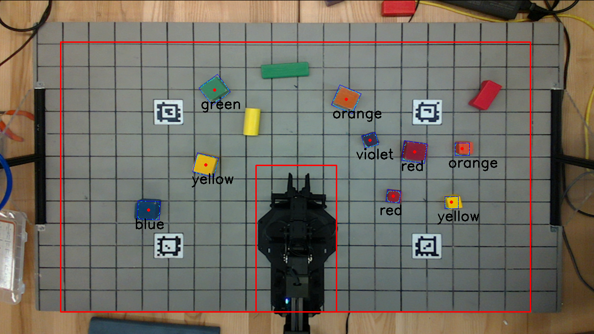

# ROB 550 Armlab-w25 @ UMich
## Overview
This repository presents the analysis of the RX200 robotic arm, along with an implementation to interact with its surrounding environment using computer vision, kinematics, and basic control. Computer vision is implemented using a Intel RealSense Lidar Camera L515 and AprilTags \[1\]. Kinematics is implemented in two parts, namely forward and inverse kinematics. The forward section of the kinematics is implemented using DH parameters \[2\]. Inverse kinematics is solved using kinematic decoupling which involves inverse position kinematics to understand the position of the wrist joint along with the geometry of a two-link manipulator to find the base joints of the RX200. Basic control is implemented through the ROS2 library and used throughout the implementation. The accuracy of the implementation is analyzed through a series of challenges which are designed to test the limits of the designed algorithm. The challenges include block detection, block sorting, block stacking and selection among adversarial objects, and the manipulation of a ball launching mechanism.

**Table of content**
- [Code structure](#code-structure)
- [How to start](#how-to-start)
- [Reference](#reference)

## Code structure

### Relevant
You do need to modify **some** of these files.
- [install_scripts](install_scripts)
    - [install_scripts/config](install_scripts/config)
        - `rs_l515_launch.py` - to launch the camera
        - `tags_Standard41h12.yaml` - to define the april tags you used on the board
    - `install_Dependencies.sh` - to install ROS2/All the ROS wrappers/Dependencies
    - `install_Interbotix.sh` - to install arm related stuff
    - `install_LaunchFiles.sh` - to move the files under `/config` to where it should to be 
- [launch](launch) - to store the launch files, details in [here](launch/README.md)
- [src](src) - where you actually write code
    - `camera.py` - Implements the Camera class for the RealSense camera. 
        - Functions to capture and convert frames
        - Functions to load camera calibration data
        - Functions to find and perform 2D transforms
        - Functions to perform world-to-camera and camera-to-world transforms
        - Functions to detect blocks in the depth and RGB frames
    - `control_station.py`
         - This is the main program. It sets up the threads and callback functions. Takes flags for whether to use the product of exponentials (PoX) or Denabit-Hartenberg (DH) table for forward kinematics and an argument for the DH table or PoX configuration. You will upgrade some functions and also implement others according to the comments given in the code.
    - `kinematics.py` - Implements functions for forward and inverse kinematics
    - `rxarm.py` - Implements the RXArm class
        - Feedback from joints
        - Functions to command the joints
        - Functions to get feedback from joints
        - Functions to do FK and IK
        - A run function to update the dynamixiel servos
        - A function to read the RX200 arm config file
    - `state_machine.py` - Implements the StateMachine class
        - The state machine is the heart of the controller
- [config](config)
    - `rx200_dh.csv` - Contains the DH table for the RX200 arm
        - You will need to fill this in
    - `rx200_pox.csv` - Containes the S list and M matrix for the RX200 arm.
        - You will need to fill this in

### Irrelevant
Not need to touch these files.
- [media](media) - where we store media that used for README instructions
- [src/resource](src/resource) - where we store the additional files used in the project

## How to start?
1. Go to [/install_scripts](install_scripts) and following the `README.md` instructions
2. Go to [/launch](launch) to start the ROS2 nodes with the `.sh` files following the `README.md` instructions

## Reference
\[1\] J. Wang and E. Olson, “Apriltag 2: Efficient and robust fiducial detection,” in 2016 IEEE/RSJ International Conference on Intel- ligent Robots and Systems (IROS), 2016, pp. 4193–4198.

\[2\] J. Denavit and R. S. Hartenberg, “A kinematic notation for lower- pair mechanisms based on matrices,” 1955.
